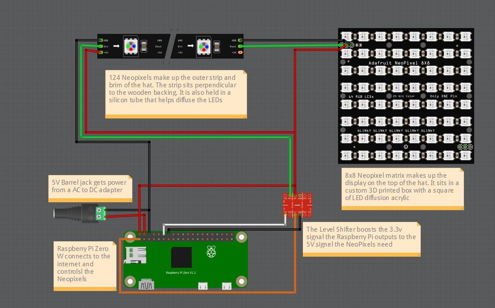

# Sign210

Sign210 is a birthday project created for [JJDB210](https://www.twitch.tv/jjdb210). The sign runs using a Raspberry Pi Zero W as the controller, controlling a 124 pixel strip and an 8 by 8 matrix. Twitch commands and events trigger hat changes, like changing the matrix or changing the color of the pixel strip. The project took about 40 days (from idea to gift-giving). Of course, not all of that time was spent on the hat. This repository serves as the latest (and hopefully greatest) code for Sign210.

## 3D Render


## Example Light Animations

### Follow Alert


### Bit Cheer Alert


### Sub Alert


### Continue Sub Alert


### Mystery Sub Alert


## Commands
### Mod Commands
- `!mod <event>` -> triggers event (ex. `!mod mysterysub`)
- `!<NAME>hat` -> sets the hat to a specific hat (ex. `!mariohat`)
- `!setdefstrip <R,G,B>` -> sets the pixel strip to RGB value (ex. `!sds 255,134,3`)
- `!setdefmatrix ` -> sets matrix to image (ex. `!sdm pokeball`)
- `!showall` -> shows all images stored within COMMANDS DB
- `!allclear` -> clears all pending events
- `!clear` -> clears pending image commands (most twitch events are unaffected)
- `!shutdown` -> shuts down the raspberry pi
- `!reboot` or `!restart` -> restarts the raspberry pi
- `!addcommand <cmd> <img_filename>` -> adds command / entry to COMMANDS DB (ex. `!ac pb pokeball.png`)
- `!deletecommand <cmd>` -> deletes command cmd (ex. `!dc pb`)

### User Commands
- `!img_cmd` -> displays image associated with `img_cmd` in COMMANDS DB for a short duration (ex. `!pokeball` -> shows `pokeball.png`  (if there is an entry in the DB)
- `!ep` -> displays the episode number of stream based on start date (and consecutive streaming)
- `!temps` -> displays the temps of the raspberry pi

## Install Instructions
***These instructions were used to install Sign210 on a Pi Zero W***
### APT Commands
```sh
sudo apt upgrade -y
sudo apt install git
sudo apt install libopenjp2-7
sudo apt-get install libjpeg-dev zlib1g-dev
```

### Cloning Repo
```sh
git clone https://github.com/klforthwind/Sign210.git
```

### Configuring Sign210 / Main
```sh
cd main
sudo pip3 install -r requirements.txt # Neopixels require sudo to run

touch .env

.env ->
------------------
# MySQL variables
MYSQL_USER=USERNAME
MYSQL_PASSWORD=PASSWORD
MYSQL_DB=sign210

# Twitch variables
TWITCH_USER=
TWITCH_USER_ID=
CLIENT_ID=
CLIENT_SECRET=
------------------
```

### Installing NodeJS on Pi Zero W
***Steps Taken From:*** [Hassan Corrigan - Install NodeJS on Pi Zero](https://hassancorrigan.com/blog/install-nodejs-on-a-raspberry-pi-zero/)

***Recommended to Install NodeJS Outside of Sign210 Repo***

```sh
wget <link to NodeJS ARM v61 from nodejs.org>
# Example: wget https://unofficial-builds.nodejs.org/download/release/v17.2.0/node-v17.2.0-linux-armv6l.tar.xz

tar xvfJ <file.tar.xz>
# Example: tar xvfJ node-v14.13.0-linux-armv6l.tar.xz

sudo cp -R <extracted tar folder>/* /usr/local
# Example: sudo cp -R node-v14.13.0-linux-armv6l/* /usr/local

rm -rf node-*

sudo reboot

node -v && npm -v # Both should work
```


### ComfyJS
***Requires NodeJS to be Installed***
```sh
cd comfyjsbot
npm install

touch .env

.env ->
------------------
# MySQL variables
MYSQL_USER=USERNAME
MYSQL_PASSWORD=PASSWORD
MYSQL_DB=sign210

# Twitch variable
TWITCH_USER=
------------------
```

### MariaDB
```sh
sudo apt install mariadb-server -y # Debian Bullseye
sudo mysql_secure_installation

sudo mysql # Puts you into mysql
SET PASSWORD FOR 'USERNAME'@'localhost' = PASSWORD('PASSWORD');

CREATE DATABASE sign210;
USE sign210;
# Run SQL scripts from scripts folder (Copy and Paste content if that's your jam)
exit # Exits mysql
sudo service mysql restart
```

### Setting Up Run On Pi Boot
```sh
# ComfyJS
cd comfyjsbot

pm2 start index.js
pm2 save
pm2 startup

# Main
crontab -e
# Add the following lines:
@reboot cd /[ABSOLUTE_PATH]/Sign210/main/; sudo python3 twitch_api.py &
@reboot cd /[ABSOLUTE_PATH]/Sign210/main/; sudo python3 run.py &

# Example:
# @reboot cd /home/pi/Desktop/Sign210/main/; sudo python3 run.py &

sudo shutdown -r now # Reboots the machine, and the code will run on boot

```


## Code Structure
### Sign210
```
.
├── comfyjsbot              # ComfyJS bot that reacts to Twitch
├── img                     # Image files for README.md
├── main                    # Python programs for Sign210
├── scripts                 # Script files (SQL files for table creation)
└── README.md
```

### ComfyJS Bot
```
.
├── comfyjsbot              # ComfyJS bot that reacts to Twitch
│   ├── .env                # Credentials for MySQL
│   ├── index.js            # NodeJS main file for Twitch events to MySQL DB 
│   └── ...                 # etc.
├── ...
└── ...
```

### Main
```
.
├── ...
├── main                    # Python programs for Sign210
│   ├── imgs                # Images used for commands and events
│   ├── .env                # Credentials for MySQL and Twitch
│   ├── command.py          # Code to process incoming commands
│   ├── db_conn.py          # Code to connect and query from MySQL DB
│   ├── extra_funcs.py      # Extra functions that didn't fit a category
│   ├── lights.py           # Code to control and change the lights / matrix
│   ├── main.py             # Main file that handles most other files
│   ├── run.py              # Boot File - pulls from git and runs main.py
│   ├── show.py             # Correlates event to function to run
│   ├── show_functions.py   # Functions ran depending on event function
│   ├── table_handler.py    # Processes MySQL for relevant events into P_QUEUE
│   ├── twitch_api.py       # Boot File - gets twitch followers and game
│   ├── requirements.txt    # Python dependencies for python files
│   ├── font5x8.bin         # Allows text in 5x8 font
│   └── ...                 # etc.
├── ...
└── ...
```

### Scripts
```
.
├── ...
├── scripts                 # Script files (SQL files for table creation)
│   ├── COMMANDS.sql        # User commands linked to image filenames 
│   ├── CONFIG.sql          # Sign210 temporal config settings 
│   ├── EVENTS.sql          # Twitch events 
│   ├── FOLLOWERS.sql       # Followers following the channel
│   └── P_QUEUE.sql         # Priority queue for events
└── ...
```

## Hardware Design

***(Credit: Cheppy44)***
